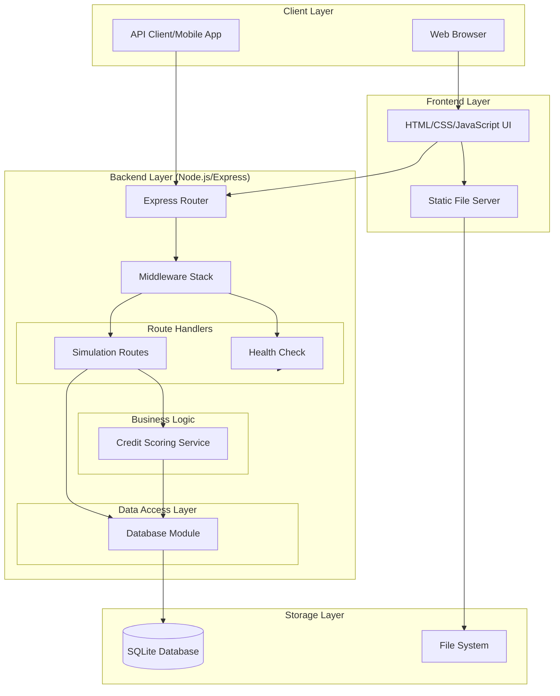
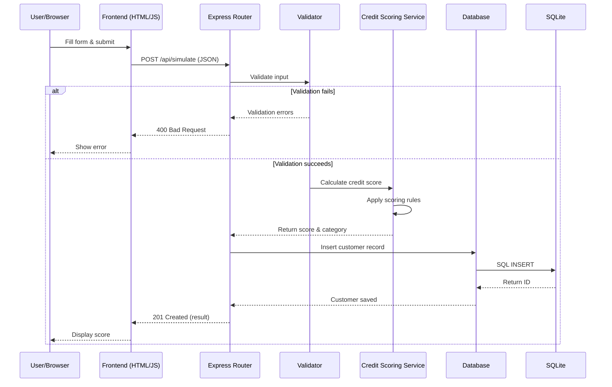

# Credit Risk Simulator - Technical Documentation

## Table of Contents

- [Project Overview](#project-overview)
- [Architecture](#architecture)
- [Technology Stack](#technology-stack)
- [Prerequisites](#prerequisites)
- [Installation & Setup](#installation--setup)
- [Running the Application](#running-the-application)
- [Project Structure](#project-structure)
- [Database Schema](#database-schema)
- [Credit Scoring Algorithm](#credit-scoring-algorithm)
- [API Endpoints](#api-endpoints)
- [Frontend Architecture](#frontend-architecture)
- [Testing](#testing)
- [Development Workflow](#development-workflow)
- [Security Considerations](#security-considerations)
- [Deployment](#deployment)
- [Troubleshooting](#troubleshooting)
- [Contributing](#contributing)

---

## Project Overview

The **Credit Risk Simulator** is a lightweight, demonstration web application built with Node.js that calculates simulated credit risk scores for educational and demonstration purposes. The application provides both a REST API and a user-friendly web interface for calculating credit scores based on customer demographics and financial data.

### Key Features

- **Rule-Based Credit Scoring**: Implements a transparent, configurable scoring algorithm
- **RESTful API**: Clean, well-documented endpoints for integration
- **Interactive Web UI**: Bootstrap 5-powered responsive interface
- **Data Persistence**: SQLite database for simulation history
- **Comprehensive Testing**: Unit and integration test coverage with Jest
- **Security**: Input validation, SQL injection protection, and security headers
- **API Documentation**: OpenAPI 3.0 specification

### Important Disclaimer

⚠️ **This is a demonstration application only.** It should NOT be used for:
- Actual credit decisions
- Production environments
- Real financial assessments
- Any purpose where credit decisions affect real people

---

## Architecture

### System Architecture Diagram



### Component Interaction Flow



---

## Technology Stack

### Backend

| Technology | Version | Purpose |
|------------|---------|---------|
| **Node.js** | v14+ | Runtime environment |
| **Express.js** | ^4.18.2 | Web framework & API server |
| **SQLite3** | ^5.1.6 | Embedded database |
| **express-validator** | ^7.0.1 | Input validation middleware |
| **Helmet** | ^7.0.0 | Security headers |
| **CORS** | ^2.8.5 | Cross-origin resource sharing |

### Frontend

| Technology | Version | Purpose |
|------------|---------|---------|
| **HTML5** | - | Markup |
| **CSS3** | - | Styling |
| **JavaScript (ES6+)** | - | Client-side logic |
| **Bootstrap** | 5.3.0 | UI framework & responsive design |
| **Bootstrap Icons** | 1.10.0 | Icon library |

### Development & Testing

| Technology | Version | Purpose |
|------------|---------|---------|
| **Jest** | ^29.6.2 | Testing framework |
| **Supertest** | ^6.3.3 | HTTP assertion library |
| **Nodemon** | ^3.0.1 | Development server with auto-reload |

---

## Prerequisites

Before you begin, ensure you have the following installed:

- **Node.js**: Version 14.x or higher
- **npm**: Version 6.x or higher (comes with Node.js)
- **Git**: For cloning the repository
- A modern web browser (Chrome, Firefox, Safari, Edge)

### Verifying Prerequisites

```bash
# Check Node.js version
node --version

# Check npm version
npm --version

# Check Git version
git --version
```

---

## Installation & Setup

### 1. Clone the Repository

```bash
git clone https://github.com/mooncowboy/creditsim.git
cd creditsim
```

### 2. Install Dependencies

```bash
npm install
```

This will install all required packages listed in `package.json`.

### 3. Set Up the Database

```bash
npm run db:setup
```

This command:
- Creates the `data/` directory if it doesn't exist
- Initializes the SQLite database at `data/creditsim.db`
- Creates the `customers` table with the required schema

### 4. Verify Installation

```bash
# Run tests to verify everything is working
npm test
```

All tests should pass if the installation was successful.

---

## Running the Application

### Production Mode

Start the server in production mode:

```bash
npm start
```

The application will be available at: **http://localhost:3000**

### Development Mode

Start the server with auto-reload for development:

```bash
npm run dev
```

The server will automatically restart when you make changes to the source files.

### Custom Port

To run on a different port, set the `PORT` environment variable:

```bash
PORT=8080 npm start
```

### Stopping the Server

Press `Ctrl+C` in the terminal to stop the server gracefully.

---

## Project Structure

```
creditsim/
├── src/                          # Source code
│   ├── app.js                    # Main Express application & entry point
│   ├── database/                 # Database layer
│   │   ├── database.js           # Database class & operations
│   │   └── setup.js              # Database initialization script
│   ├── routes/                   # API route handlers
│   │   └── simulation.js         # Credit simulation endpoints
│   └── services/                 # Business logic layer
│       └── creditScoring.js      # Credit scoring algorithm
├── public/                       # Frontend static files
│   ├── index.html                # Main web interface
│   └── app.js                    # Client-side JavaScript
├── tests/                        # Test suites
│   ├── creditScoring.test.js     # Unit tests for scoring logic
│   └── api.test.js               # Integration tests for API
├── data/                         # Database storage (generated)
│   └── creditsim.db              # SQLite database file
├── docs/                         # Documentation
│   ├── api.yaml                  # OpenAPI 3.0 specification
│   └── mockups/                  # UI mockups
├── .github/                      # GitHub configuration
│   ├── workflows/                # CI/CD workflows
│   └── agents/                   # Custom agent definitions
├── package.json                  # Project metadata & dependencies
├── package-lock.json             # Locked dependency versions
├── .gitignore                    # Git ignore rules
├── LICENSE                       # MIT license
├── README.md                     # User-facing documentation
├── QUICKSTART.md                 # Quick start guide
└── DOCS.md                       # This file (technical documentation)
```

### Key Files Explained

#### `src/app.js`
The main application entry point. Responsibilities:
- Express server initialization
- Middleware configuration (security, CORS, body parsing)
- Route registration
- Static file serving
- Error handling
- Database initialization
- Graceful shutdown handling

#### `src/services/creditScoring.js`
Pure business logic for credit scoring. Contains:
- `calculateCreditScore()`: Main scoring algorithm
- `determineRiskCategory()`: Risk categorization logic
- `validateCustomerData()`: Data validation
- `getScoringCriteria()`: Scoring rules documentation

#### `src/routes/simulation.js`
Express route handlers for API endpoints:
- Input validation using express-validator
- Request/response handling
- Database interaction
- Error handling

#### `src/database/database.js`
Database abstraction layer with:
- Database connection management
- Table creation
- CRUD operations for customer records
- Promise-based API

#### `public/index.html` & `public/app.js`
Frontend application:
- Bootstrap-based responsive UI
- Form handling and validation
- API communication
- Results display
- Simulation history

---

## Database Schema

### `customers` Table

The application uses a single table to store all simulation records.

| Column | Type | Constraints | Description |
|--------|------|-------------|-------------|
| `id` | INTEGER | PRIMARY KEY, AUTOINCREMENT | Unique identifier |
| `name` | TEXT | NOT NULL | Customer full name |
| `age` | INTEGER | NOT NULL | Customer age (18-120) |
| `annualIncome` | REAL | NOT NULL | Annual income in dollars |
| `debtToIncomeRatio` | REAL | NOT NULL | Debt-to-income ratio (0-1) |
| `loanAmount` | REAL | NOT NULL | Requested loan amount |
| `creditHistory` | TEXT | NOT NULL, CHECK IN ('good', 'bad') | Credit history status |
| `score` | INTEGER | NOT NULL | Calculated credit score (300-850) |
| `riskCategory` | TEXT | NOT NULL, CHECK IN ('Low risk', 'Medium risk', 'High risk') | Risk category |
| `createdAt` | DATETIME | DEFAULT CURRENT_TIMESTAMP | Record creation timestamp |

### Database Location

- **Path**: `data/creditsim.db`
- **Format**: SQLite 3
- **Access**: File-based, single-connection

### Sample SQL Queries

```sql
-- Get all simulations
SELECT * FROM customers ORDER BY createdAt DESC;

-- Get simulation by ID
SELECT * FROM customers WHERE id = ?;

-- Get high-risk simulations
SELECT * FROM customers WHERE riskCategory = 'High risk';

-- Get statistics
SELECT 
  riskCategory,
  COUNT(*) as count,
  AVG(score) as avg_score,
  MIN(score) as min_score,
  MAX(score) as max_score
FROM customers
GROUP BY riskCategory;
```

---

## Credit Scoring Algorithm

### Overview

The credit scoring algorithm is a **rule-based system** that starts with a base score and applies adjustments based on customer attributes. The final score is constrained to the standard FICO range (300-850).

### Scoring Formula

```
Final Score = Base Score + Age Adjustment + Income Adjustment 
              + Debt Adjustment + Credit History Adjustment 
              + Loan-to-Income Adjustment

Constrained to: 300 ≤ Final Score ≤ 850
```

### Base Score

- **Starting Point**: 600 points

### Adjustment Rules

#### 1. Age Adjustments

| Condition | Adjustment | Rationale |
|-----------|------------|-----------|
| Age < 25 | -50 points | Limited credit history |
| Age > 60 | -30 points | Approaching retirement |
| 25 ≤ Age ≤ 60 | 0 points | Optimal age range |

#### 2. Income Adjustments

| Annual Income | Adjustment | Rationale |
|---------------|------------|-----------|
| > $200,000 | +120 points | Very high income |
| $100,001 - $200,000 | +80 points | High income |
| $50,001 - $100,000 | +40 points | Moderate income |
| ≤ $50,000 | 0 points | Lower income |

#### 3. Debt-to-Income Ratio

| DTI Ratio | Adjustment | Rationale |
|-----------|------------|-----------|
| > 0.40 (40%) | -80 points | High debt burden |
| ≤ 0.40 | 0 points | Manageable debt |

#### 4. Credit History

| History | Adjustment | Rationale |
|---------|------------|-----------|
| Bad | -150 points | Payment issues |
| Good | 0 points | Positive history |

#### 5. Loan-to-Income Ratio

Calculated as: `Loan Amount / Annual Income`

| LTI Ratio | Adjustment | Rationale |
|-----------|------------|-----------|
| > 0.50 (50%) | -50 points | High loan burden |
| 0.25 - 0.50 | +15 points | Moderate loan |
| 0.10 - 0.25 | +15 points | Low loan |
| < 0.10 | +30 points | Very low loan |

### Risk Categories

Final scores are categorized into three risk levels:

| Score Range | Category | Description |
|-------------|----------|-------------|
| 750 - 850 | **Low risk** | Excellent credit profile |
| 650 - 749 | **Medium risk** | Acceptable credit profile |
| 300 - 649 | **High risk** | Concerning credit profile |

### Example Calculation

**Input:**
- Age: 35
- Annual Income: $75,000
- Debt-to-Income Ratio: 0.25 (25%)
- Loan Amount: $30,000
- Credit History: Good

**Calculation:**
```
Base Score:              600
Age (25-60):            +  0
Income ($50k-$100k):    + 40
DTI Ratio (≤40%):       +  0
Credit History (good):  +  0
LTI (0.4 = 40%):        + 15
─────────────────────────────
Total:                   655
Risk Category:           Medium risk
```

### Implementation

The scoring logic is implemented in `src/services/creditScoring.js`:

```javascript
function calculateCreditScore(customerData) {
  let score = 600; // Base score
  
  // Apply all adjustment rules
  // ... (see source code for details)
  
  // Constrain to FICO range
  score = Math.max(300, Math.min(850, score));
  
  return {
    score: Math.round(score),
    riskCategory: determineRiskCategory(score)
  };
}
```

---

## API Endpoints

All API endpoints are prefixed with `/api` and return JSON responses.

### Base URL

```
http://localhost:3000/api
```

### Endpoints Summary

| Method | Endpoint | Description |
|--------|----------|-------------|
| POST | `/simulate` | Calculate credit score for new customer |
| GET | `/simulations` | Retrieve all simulation records |
| GET | `/simulation/:id` | Retrieve specific simulation by ID |
| GET | `/scoring-criteria` | Get scoring algorithm documentation |
| GET | `/health` | Health check endpoint |

---

### POST /api/simulate

Calculate a credit score for a customer.

#### Request

**Headers:**
```
Content-Type: application/json
```

**Body:**
```json
{
  "name": "John Doe",
  "age": 35,
  "annualIncome": 60000,
  "debtToIncomeRatio": 0.3,
  "loanAmount": 25000,
  "creditHistory": "good"
}
```

**Field Validations:**

| Field | Type | Constraints | Description |
|-------|------|-------------|-------------|
| `name` | string | 1-100 chars | Customer full name |
| `age` | integer | 18-120 | Customer age in years |
| `annualIncome` | number | ≥ 0 | Annual income in dollars |
| `debtToIncomeRatio` | number | 0-1 | Debt-to-income as decimal (0.3 = 30%) |
| `loanAmount` | number | > 0 | Requested loan amount |
| `creditHistory` | string | "good" or "bad" | Credit history status |

#### Response

**Success (201 Created):**
```json
{
  "id": 1,
  "score": 640,
  "riskCategory": "Medium risk",
  "message": "Credit score calculated successfully",
  "customer": {
    "name": "John Doe",
    "age": 35,
    "annualIncome": 60000,
    "debtToIncomeRatio": 0.3,
    "loanAmount": 25000,
    "creditHistory": "good"
  }
}
```

**Validation Error (400 Bad Request):**
```json
{
  "error": "Validation failed",
  "details": [
    {
      "type": "field",
      "msg": "Age must be an integer between 18 and 120",
      "path": "age",
      "location": "body"
    }
  ]
}
```

**Server Error (500):**
```json
{
  "error": "Failed to calculate credit score",
  "message": "Error details..."
}
```

#### cURL Example

```bash
curl -X POST http://localhost:3000/api/simulate \
  -H "Content-Type: application/json" \
  -d '{
    "name": "Jane Smith",
    "age": 28,
    "annualIncome": 75000,
    "debtToIncomeRatio": 0.25,
    "loanAmount": 30000,
    "creditHistory": "good"
  }'
```

---

### GET /api/simulations

Retrieve all simulation records, ordered by most recent first.

#### Request

No parameters required.

#### Response

**Success (200 OK):**
```json
{
  "count": 2,
  "simulations": [
    {
      "id": 2,
      "name": "Jane Smith",
      "score": 665,
      "riskCategory": "Medium risk",
      "loanAmount": 30000,
      "createdAt": "2024-01-15T14:30:00.000Z"
    },
    {
      "id": 1,
      "name": "John Doe",
      "score": 640,
      "riskCategory": "Medium risk",
      "loanAmount": 25000,
      "createdAt": "2024-01-15T10:30:00.000Z"
    }
  ]
}
```

**Server Error (500):**
```json
{
  "error": "Failed to fetch simulations",
  "message": "Error details..."
}
```

#### cURL Example

```bash
curl http://localhost:3000/api/simulations
```

---

### GET /api/simulation/:id

Retrieve detailed information for a specific simulation.

#### Request

**URL Parameters:**
- `id` (integer): Simulation ID

#### Response

**Success (200 OK):**
```json
{
  "simulation": {
    "id": 1,
    "name": "John Doe",
    "age": 35,
    "annualIncome": 60000,
    "debtToIncomeRatio": 0.3,
    "loanAmount": 25000,
    "creditHistory": "good",
    "score": 640,
    "riskCategory": "Medium risk",
    "createdAt": "2024-01-15T10:30:00.000Z"
  }
}
```

**Not Found (404):**
```json
{
  "error": "Simulation not found",
  "message": "No simulation found with ID 999"
}
```

**Invalid ID (400):**
```json
{
  "error": "Validation failed",
  "details": [
    {
      "type": "field",
      "msg": "ID must be a positive integer",
      "path": "id",
      "location": "params"
    }
  ]
}
```

#### cURL Example

```bash
curl http://localhost:3000/api/simulation/1
```

---

### GET /api/scoring-criteria

Get detailed explanation of the credit scoring algorithm.

#### Request

No parameters required.

#### Response

**Success (200 OK):**
```json
{
  "criteria": {
    "baseScore": 600,
    "adjustments": {
      "age": {
        "under25": -50,
        "over60": -30
      },
      "income": {
        "over50k": 40
      },
      "debtToIncomeRatio": {
        "over40percent": -80
      },
      "creditHistory": {
        "bad": -150
      },
      "loanToIncomeRatio": {
        "over50percent": -50
      }
    },
    "riskCategories": {
      "lowRisk": "750+",
      "mediumRisk": "650-749",
      "highRisk": "Below 650"
    }
  },
  "disclaimer": "This is a demonstration scoring model and should not be used for actual credit decisions."
}
```

#### cURL Example

```bash
curl http://localhost:3000/api/scoring-criteria
```

---

### GET /api/health

Health check endpoint for monitoring and load balancers.

#### Request

No parameters required.

#### Response

**Success (200 OK):**
```json
{
  "status": "healthy",
  "timestamp": "2024-01-15T10:30:00.000Z",
  "uptime": 3600
}
```

- `status`: Always "healthy" if server responds
- `timestamp`: Current server time in ISO format
- `uptime`: Server uptime in seconds

#### cURL Example

```bash
curl http://localhost:3000/api/health
```

---

## Frontend Architecture

### Overview

The frontend is a single-page application built with vanilla JavaScript, HTML5, and Bootstrap 5. It provides an interactive interface for credit score calculations and displays simulation history.

### File Structure

```
public/
├── index.html    # Main HTML page with form and results display
└── app.js        # Client-side JavaScript for UI logic and API calls
```

### Key Features

#### 1. Customer Input Form
- Bootstrap-styled responsive form
- Real-time validation feedback
- Range sliders for ratio inputs
- Dropdown for credit history selection

#### 2. Score Display
- Large, prominent score visualization
- Color-coded risk categories:
  - Green border: Low risk
  - Yellow border: Medium risk
  - Red border: High risk
- Detailed customer information display

#### 3. Simulation History
- List of all previous simulations
- Clickable items to view details
- Badges showing risk categories
- Chronological ordering (newest first)

#### 4. API Integration
- Fetch API for HTTP requests
- Error handling and user feedback
- Loading states during API calls

### UI Components

#### Form Inputs

```html
<input type="text" id="name" name="name" required>
<input type="number" id="age" min="18" max="120" required>
<input type="number" id="annualIncome" min="0" required>
<input type="number" id="debtToIncomeRatio" min="0" max="1" step="0.01" required>
<input type="number" id="loanAmount" min="1" required>
<select id="creditHistory" required>
  <option value="good">Good</option>
  <option value="bad">Bad</option>
</select>
```

#### API Call Example

```javascript
async function calculateScore(customerData) {
  const response = await fetch('/api/simulate', {
    method: 'POST',
    headers: { 'Content-Type': 'application/json' },
    body: JSON.stringify(customerData)
  });
  
  if (!response.ok) {
    throw new Error('Calculation failed');
  }
  
  return await response.json();
}
```

### Styling

The application uses:
- **Bootstrap 5.3.0**: For responsive grid, components, and utilities
- **Bootstrap Icons 1.10.0**: For icons
- **Custom CSS**: For score card styling and hover effects

---

## Testing

### Test Framework

The application uses **Jest** for both unit and integration testing.

### Running Tests

```bash
# Run all tests once
npm test

# Run tests in watch mode (re-runs on file changes)
npm run test:watch

# Run tests with coverage report
npm test -- --coverage
```

### Test Structure

```
tests/
├── creditScoring.test.js    # Unit tests for scoring logic
└── api.test.js              # Integration tests for API endpoints
```

### Test Coverage

The test suite covers:

#### 1. Unit Tests (`creditScoring.test.js`)

**Credit Scoring Service:**
- Base score calculation
- Age adjustments (under 25, over 60)
- Income adjustments (multiple brackets)
- Debt-to-income ratio penalties
- Credit history penalties
- Loan-to-income ratio adjustments
- Score constraints (300-850 range)
- Risk category determination
- Input validation
- Edge cases and boundary conditions

**Example Test:**
```javascript
test('should calculate base score for typical customer', () => {
  const customer = {
    age: 35,
    annualIncome: 60000,
    debtToIncomeRatio: 0.3,
    loanAmount: 25000,
    creditHistory: 'good'
  };
  
  const result = calculateCreditScore(customer);
  
  expect(result.score).toBe(640);
  expect(result.riskCategory).toBe('Medium risk');
});
```

#### 2. Integration Tests (`api.test.js`)

**API Endpoints:**
- POST /api/simulate
  - Successful score calculation
  - Input validation errors
  - Database persistence
- GET /api/simulations
  - Retrieve all records
  - Empty database handling
- GET /api/simulation/:id
  - Retrieve specific record
  - Not found handling
  - Invalid ID handling
- GET /api/scoring-criteria
  - Criteria retrieval
- GET /api/health
  - Health check response

**Example Test:**
```javascript
test('POST /api/simulate - should calculate score', async () => {
  const response = await request(app)
    .post('/api/simulate')
    .send({
      name: 'Test User',
      age: 30,
      annualIncome: 60000,
      debtToIncomeRatio: 0.3,
      loanAmount: 25000,
      creditHistory: 'good'
    });
  
  expect(response.status).toBe(201);
  expect(response.body).toHaveProperty('score');
  expect(response.body).toHaveProperty('riskCategory');
});
```

### Test Configuration

Jest configuration in `package.json`:

```json
{
  "jest": {
    "testEnvironment": "node",
    "collectCoverageFrom": [
      "src/**/*.js",
      "!src/database/setup.js"
    ]
  }
}
```

### Writing New Tests

When adding new features:

1. **Unit Tests**: Add to `tests/creditScoring.test.js` for business logic
2. **Integration Tests**: Add to `tests/api.test.js` for API endpoints
3. Follow existing test patterns
4. Ensure tests are isolated and don't depend on each other
5. Mock external dependencies when necessary

---

## Development Workflow

### Setting Up Development Environment

1. **Clone and install:**
   ```bash
   git clone https://github.com/mooncowboy/creditsim.git
   cd creditsim
   npm install
   npm run db:setup
   ```

2. **Start development server:**
   ```bash
   npm run dev
   ```

3. **Run tests in watch mode:**
   ```bash
   npm run test:watch
   ```

### Making Changes

#### Backend Changes

1. Modify source files in `src/`
2. Server auto-reloads with nodemon
3. Test your changes:
   ```bash
   npm test
   ```

#### Frontend Changes

1. Modify files in `public/`
2. Refresh browser to see changes
3. No build step required

#### Database Changes

1. Modify schema in `src/database/database.js`
2. Delete existing database:
   ```bash
   rm data/creditsim.db
   ```
3. Recreate database:
   ```bash
   npm run db:setup
   ```

### Code Style

The project follows these conventions:

- **Indentation**: 2 spaces
- **Quotes**: Single quotes for JavaScript
- **Semicolons**: Required
- **Line length**: 120 characters max
- **Naming**:
  - camelCase for variables and functions
  - PascalCase for classes
  - UPPER_CASE for constants

### Git Workflow

1. Create feature branch:
   ```bash
   git checkout -b feature/your-feature-name
   ```

2. Make changes and commit:
   ```bash
   git add .
   git commit -m "Description of changes"
   ```

3. Run tests before pushing:
   ```bash
   npm test
   ```

4. Push to remote:
   ```bash
   git push origin feature/your-feature-name
   ```

### Debugging

#### Backend Debugging

Add console.log statements or use Node.js debugger:

```bash
node --inspect src/app.js
```

Then connect with Chrome DevTools or VS Code debugger.

#### Frontend Debugging

Use browser DevTools:
- Console for JavaScript errors
- Network tab for API requests
- Elements tab for DOM inspection

#### Common Issues

**Port already in use:**
```bash
# Find process using port 3000
lsof -ti:3000

# Kill the process
kill -9 $(lsof -ti:3000)
```

**Database locked:**
```bash
# Close all connections and restart server
rm data/creditsim.db
npm run db:setup
npm start
```

---

## Security Considerations

### Implemented Security Measures

#### 1. Input Validation

**Server-Side Validation:**
- express-validator for all POST endpoints
- Type checking (integer, float, string)
- Range validation (min/max values)
- Whitelist validation for enums
- Sanitization of string inputs

**Client-Side Validation:**
- HTML5 form validation attributes
- JavaScript validation before submission
- User-friendly error messages

#### 2. SQL Injection Protection

- **Parameterized Queries**: All database queries use parameterized statements
- **No String Concatenation**: Never concatenate user input into SQL
- **Example:**
  ```javascript
  db.run('SELECT * FROM customers WHERE id = ?', [id]);
  // NOT: db.run(`SELECT * FROM customers WHERE id = ${id}`);
  ```

#### 3. Security Headers (Helmet.js)

```javascript
helmet({
  contentSecurityPolicy: {
    directives: {
      defaultSrc: ["'self'"],
      styleSrc: ["'self'", "'unsafe-inline'", "https://cdn.jsdelivr.net"],
      scriptSrc: ["'self'", "https://cdn.jsdelivr.net"],
      fontSrc: ["'self'", "https://cdn.jsdelivr.net"]
    }
  }
})
```

Headers applied:
- X-Content-Type-Options: nosniff
- X-Frame-Options: DENY
- X-XSS-Protection: 1; mode=block
- Content-Security-Policy
- Strict-Transport-Security (HTTPS only)

#### 4. CORS Configuration

```javascript
app.use(cors());
```

Allows cross-origin requests for API accessibility.

#### 5. Error Handling

- No stack traces in production
- Generic error messages to clients
- Detailed logging on server side

### Security Limitations

⚠️ **This is a demonstration application.** The following security features are NOT implemented:

1. **No Authentication/Authorization**
   - No user login
   - No API keys
   - No access control

2. **No Rate Limiting**
   - Vulnerable to abuse
   - No request throttling
   - No DDoS protection

3. **No HTTPS**
   - Data transmitted in plain text
   - No encryption

4. **No Session Management**
   - No user sessions
   - No CSRF protection

5. **SQLite Limitations**
   - Not suitable for high concurrency
   - No replication or backup
   - Single point of failure

### Recommendations for Production

If adapting this for production use:

1. **Add Authentication**: Implement JWT or OAuth2
2. **Enable HTTPS**: Use TLS certificates
3. **Add Rate Limiting**: Use express-rate-limit
4. **Use Production Database**: PostgreSQL or MySQL
5. **Add Monitoring**: Log aggregation and alerting
6. **Implement Backups**: Regular database backups
7. **Add API Versioning**: /api/v1/ prefix
8. **Enable CSRF Protection**: For state-changing operations
9. **Add Request Logging**: Winston or similar
10. **Security Audits**: Regular dependency updates and security scans

---

## Deployment

### Environment Variables

The application supports the following environment variables:

| Variable | Description | Default |
|----------|-------------|---------|
| `PORT` | Server port | 3000 |
| `NODE_ENV` | Environment mode | development |

Create a `.env` file (do NOT commit this file):

```env
PORT=3000
NODE_ENV=production
```

### Deployment Options

#### Option 1: Traditional Server (VM/VPS)

1. **Install Node.js** on server
2. **Clone repository:**
   ```bash
   git clone https://github.com/mooncowboy/creditsim.git
   cd creditsim
   ```
3. **Install dependencies:**
   ```bash
   npm ci --production
   ```
4. **Set up database:**
   ```bash
   npm run db:setup
   ```
5. **Start with PM2:**
   ```bash
   npm install -g pm2
   pm2 start src/app.js --name creditsim
   pm2 save
   pm2 startup
   ```

#### Option 2: Docker

Create `Dockerfile`:

```dockerfile
FROM node:18-alpine
WORKDIR /app
COPY package*.json ./
RUN npm ci --production
COPY . .
RUN npm run db:setup
EXPOSE 3000
CMD ["node", "src/app.js"]
```

Build and run:

```bash
docker build -t creditsim .
docker run -p 3000:3000 creditsim
```

#### Option 3: Azure App Service

The repository includes a GitHub Actions workflow for Azure deployment:

`.github/workflows/main_rifiel-creditsim-france.yml`

Configure:
1. Create Azure App Service (Node.js)
2. Set up GitHub secrets:
   - `AZUREAPPSERVICE_PUBLISHPROFILE`
3. Push to trigger deployment

#### Option 4: Heroku

```bash
heroku create your-app-name
git push heroku main
heroku run npm run db:setup
heroku open
```

### Pre-Deployment Checklist

- [ ] All tests passing
- [ ] Environment variables configured
- [ ] Database initialized
- [ ] Dependencies updated and secure
- [ ] Error handling tested
- [ ] Performance benchmarks acceptable
- [ ] Backup strategy in place
- [ ] Monitoring configured
- [ ] SSL/TLS enabled
- [ ] Security headers verified

### Post-Deployment

1. **Health Check:**
   ```bash
   curl https://your-domain.com/api/health
   ```

2. **Smoke Test:**
   ```bash
   curl -X POST https://your-domain.com/api/simulate \
     -H "Content-Type: application/json" \
     -d '{"name":"Test","age":30,"annualIncome":50000,"debtToIncomeRatio":0.3,"loanAmount":20000,"creditHistory":"good"}'
   ```

3. **Monitor Logs:**
   - Check for errors
   - Verify database connectivity
   - Monitor response times

---

## Troubleshooting

### Common Issues

#### Server Won't Start

**Error: Port already in use**
```bash
# Find and kill process on port 3000
lsof -ti:3000 | xargs kill -9

# Or use a different port
PORT=8080 npm start
```

**Error: Cannot find module**
```bash
# Reinstall dependencies
rm -rf node_modules package-lock.json
npm install
```

#### Database Issues

**Error: Database file not found**
```bash
# Initialize database
npm run db:setup
```

**Error: Database is locked**
```bash
# Close all connections and restart
rm data/creditsim.db
npm run db:setup
npm start
```

**Error: Table doesn't exist**
```bash
# Recreate database
rm data/creditsim.db
npm run db:setup
```

#### Test Failures

**Tests fail after code changes**
```bash
# Clear Jest cache
npx jest --clearCache

# Run tests again
npm test
```

**Database conflicts in tests**
- Tests use in-memory database
- Ensure test database is isolated
- Check for lingering connections

#### API Issues

**404 Not Found**
- Check URL path (should include `/api`)
- Verify server is running
- Check for typos in endpoint

**400 Bad Request**
- Validate request body structure
- Check data types and ranges
- Review validation error details

**500 Internal Server Error**
- Check server logs
- Verify database connectivity
- Review error details in development mode

### Debug Mode

Enable verbose logging:

```javascript
// In src/app.js
console.log('Request:', req.method, req.path);
console.log('Body:', req.body);
```

### Getting Help

1. Check this documentation
2. Review existing GitHub issues
3. Check the README.md and QUICKSTART.md
4. Review the OpenAPI specification in `docs/api.yaml`

---

## Contributing

### How to Contribute

1. **Fork the repository**
2. **Create a feature branch:**
   ```bash
   git checkout -b feature/your-feature
   ```
3. **Make your changes**
4. **Add tests** for new functionality
5. **Ensure tests pass:**
   ```bash
   npm test
   ```
6. **Commit with clear message:**
   ```bash
   git commit -m "Add: description of feature"
   ```
7. **Push to your fork:**
   ```bash
   git push origin feature/your-feature
   ```
8. **Open a Pull Request**

### Contribution Guidelines

- Follow existing code style
- Add tests for new features
- Update documentation
- One feature per pull request
- Write clear commit messages

### Areas for Improvement

Potential enhancements:

- [ ] User authentication system
- [ ] More sophisticated scoring algorithms
- [ ] Data visualization and charts
- [ ] Export functionality (PDF, CSV)
- [ ] Rate limiting for API
- [ ] Pagination for simulation list
- [ ] Search and filter capabilities
- [ ] Multiple scoring models
- [ ] Historical trend analysis
- [ ] Mobile app companion

---

## License

This project is licensed under the **MIT License**. See the [LICENSE](LICENSE) file for details.

---

## Disclaimer

**⚠️ IMPORTANT: This is a demonstration application for educational purposes only.**

- Do NOT use for actual credit decisions
- Do NOT deploy to production without significant enhancements
- Do NOT use with real customer data
- The scoring algorithm is simplified and not based on real credit scoring models

For real credit scoring, consult professional credit risk management systems and comply with all applicable regulations (FCRA, ECOA, etc.).

---

## Contact & Support

- **Repository**: https://github.com/mooncowboy/creditsim
- **Issues**: https://github.com/mooncowboy/creditsim/issues
- **License**: MIT

---

*Last Updated: 2024-12-06*
*Version: 1.0.0*
