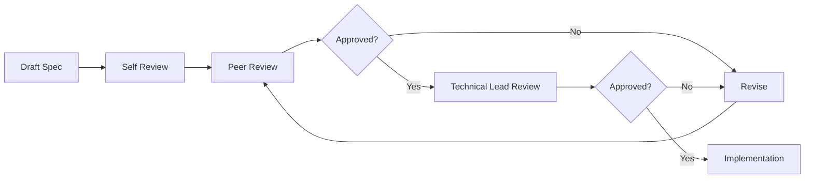

# Specification Guidelines for Credit Risk Simulator

## Document Version
**Version:** 1.0.0  
**Last Updated:** December 14, 2025  
**Applies To:** All new features and enhancements for Credit Risk Simulator

---

## Table of Contents

1. [Introduction](#introduction)
2. [Document Structure](#document-structure)
3. [Functional Specifications](#functional-specifications)
4. [Technical Specifications](#technical-specifications)
5. [API Design Guidelines](#api-design-guidelines)
6. [Database Schema Guidelines](#database-schema-guidelines)
7. [Frontend Implementation Guidelines](#frontend-implementation-guidelines)
8. [Testing Requirements](#testing-requirements)
9. [Security Requirements](#security-requirements)
10. [Documentation Standards](#documentation-standards)
11. [Review and Approval Process](#review-and-approval-process)

---

## 1. Introduction

### Purpose
This document establishes standards for creating functional and technical specifications for the Credit Risk Simulator project. All new features must follow these guidelines to ensure consistency, maintainability, and quality.

### Scope
These guidelines apply to:
- New feature development
- Major enhancements to existing features
- API endpoint additions or modifications
- Database schema changes
- Frontend component development

### Key Principles
1. **Clarity**: Specifications must be clear and unambiguous
2. **Completeness**: All aspects of implementation must be covered
3. **Consistency**: Follow established project patterns and conventions
4. **Security**: Security considerations must be explicit
5. **Testability**: Features must be designed with testing in mind

---

## 2. Document Structure

Every specification document must include the following sections:

### Required Sections

#### 2.1 Document Header
```markdown
# Feature Name: [Clear, Descriptive Title]

**Feature ID:** [JIRA-XXX or unique identifier]
**Author:** [Name]
**Created:** [Date]
**Last Updated:** [Date]
**Status:** [Draft | Review | Approved | In Development | Completed]
**Priority:** [High | Medium | Low]
**Target Release:** [Version number]

## Related Documents
- Link to JIRA ticket
- Link to design mockups (if applicable)
- Link to related specifications
```

#### 2.2 Executive Summary
- Brief overview (2-3 sentences)
- Business value and user benefit
- High-level technical approach

#### 2.3 Requirements
- User stories or use cases
- Functional requirements (numbered)
- Non-functional requirements (performance, scalability, etc.)
- Dependencies and prerequisites

#### 2.4 Technical Design
- Architecture changes or additions
- Component interactions (use Mermaid diagrams)
- Technology choices and justifications

#### 2.5 Implementation Details
- Detailed technical specifications
- Code structure and organization
- Configuration changes

#### 2.6 Testing Strategy
- Unit test requirements
- Integration test requirements
- Manual test scenarios

#### 2.7 Security Considerations
- Authentication/authorization requirements
- Data validation requirements
- Security risks and mitigations

#### 2.8 Rollout Plan
- Deployment steps
- Database migration strategy
- Rollback plan

---

## 3. Functional Specifications

### 3.1 User Stories Format

Use this template for user stories:

```markdown
**As a** [type of user]
**I want** [to perform some action]
**So that** [I can achieve some goal]

**Acceptance Criteria:**
- [ ] Criterion 1
- [ ] Criterion 2
- [ ] Criterion 3

**Out of Scope:**
- What is explicitly NOT included in this feature
```

### 3.2 Use Case Documentation

For complex features, document use cases:

```markdown
### Use Case: [Name]

**Actor:** [Primary user type]
**Preconditions:**
- Condition 1
- Condition 2

**Main Flow:**
1. User action
2. System response
3. ...

**Alternative Flows:**
- Error scenario 1
- Error scenario 2

**Postconditions:**
- System state after successful completion
```

### 3.3 Business Logic Rules

Document all business rules clearly:

```markdown
### Business Rules

**BR-001: Credit Score Adjustment**
- Base score starts at 600
- Age penalties: <25 (-50 points), >60 (-30 points)
- Income bonuses: >$200k (+120), >$100k (+80), >$50k (+40)
- Score range: 300-850 (FICO standard)

**Rationale:** Aligns with industry-standard scoring ranges
**Impact:** Medium - affects all credit calculations
**Validation:** Must be tested with boundary values
```

### 3.4 UI/UX Requirements

For features with UI components:

```markdown
### User Interface Requirements

**Layout:**
- Describe page structure
- Reference mockups (attach files or links)

**User Interactions:**
- Form behavior (validation, submission)
- Button actions
- Error message display
- Success feedback

**Responsive Design:**
- Mobile behavior (<768px)
- Tablet behavior (768px-1024px)
- Desktop behavior (>1024px)

**Accessibility:**
- ARIA labels
- Keyboard navigation
- Screen reader support
```

---

## 4. Technical Specifications

### 4.1 Architecture Patterns

Follow the established layered architecture:

```
┌─────────────────────────────────┐
│     Frontend (Public/)          │  ← HTML, CSS, JavaScript
└─────────────────────────────────┘
              ↓ HTTP/JSON
┌─────────────────────────────────┐
│     Routes (src/routes/)        │  ← Express routes + validation
└─────────────────────────────────┘
              ↓
┌─────────────────────────────────┐
│   Services (src/services/)      │  ← Business logic
└─────────────────────────────────┘
              ↓
┌─────────────────────────────────┐
│   Database (src/database/)      │  ← Data access layer
└─────────────────────────────────┘
              ↓
┌─────────────────────────────────┐
│     SQLite Database             │  ← Persistence
└─────────────────────────────────┘
```

**Requirements:**
- Keep layers separate and loosely coupled
- No direct database calls from routes
- Business logic stays in services
- Routes handle HTTP concerns only

### 4.2 File Organization

Place files according to these conventions:

```
src/
├── routes/           # Express route handlers
│   └── [feature].js  # One file per major feature area
├── services/         # Business logic and calculations
│   └── [feature].js  # Stateless service functions
├── database/         # Database access layer
│   └── database.js   # Shared database class
└── app.js           # Main Express app configuration

public/              # Frontend assets
├── app.js          # Main frontend JavaScript
├── index.html      # HTML structure
└── styles/         # CSS files

tests/              # Test files
├── [feature].test.js  # Mirror src structure
└── api.test.js     # API integration tests
```

### 4.3 Code Style Standards

#### 4.3.1 JavaScript Style

Follow these conventions:

```javascript
// ✅ CORRECT: Use async/await for asynchronous operations
async function processCustomer(data) {
  try {
    const result = await database.insertCustomer(data);
    return result;
  } catch (error) {
    console.error('Error processing customer:', error);
    throw error;
  }
}

// ✅ CORRECT: Use destructuring for cleaner code
const { name, age, annualIncome } = customerData;

// ✅ CORRECT: Use template literals for strings
const message = `Customer ${name} scored ${score} points`;

// ✅ CORRECT: Document complex functions with JSDoc
/**
 * Calculate credit score based on customer financial data
 * @param {Object} customerData - Customer information
 * @param {number} customerData.age - Customer age (18-120)
 * @param {number} customerData.annualIncome - Annual income in dollars
 * @returns {Object} Score and risk category
 */
function calculateCreditScore(customerData) {
  // Implementation
}

// ❌ INCORRECT: Don't use callbacks when async/await is available
function processCustomer(data, callback) {
  database.insertCustomer(data, (err, result) => {
    // Don't do this
  });
}

// ❌ INCORRECT: Don't ignore error handling
async function processCustomer(data) {
  const result = await database.insertCustomer(data); // No try/catch!
  return result;
}
```

#### 4.3.2 Naming Conventions

```javascript
// Variables and functions: camelCase
const customerScore = 640;
function calculateRiskCategory() {}

// Classes: PascalCase
class Database {}
class CreditSimulator {}

// Constants: UPPER_SNAKE_CASE
const MAX_CREDIT_SCORE = 850;
const MIN_AGE_REQUIREMENT = 18;

// Private/internal: prefix with underscore
function _internalHelper() {}

// Boolean variables: use is/has/should prefix
const isValid = true;
const hasError = false;
const shouldRetry = true;
```

#### 4.3.3 Error Handling Standards

```javascript
// ✅ CORRECT: Specific error messages
if (!customerData.name) {
  throw new Error('Customer name is required');
}

// ✅ CORRECT: Catch and log errors appropriately
try {
  await database.insertCustomer(data);
} catch (error) {
  console.error('Error inserting customer:', error);
  throw new Error('Failed to save customer data');
}

// ✅ CORRECT: Return user-friendly error responses
res.status(400).json({
  error: 'Validation failed',
  details: validationErrors,
  message: 'Please check your input and try again'
});

// ❌ INCORRECT: Generic error messages
throw new Error('Error');

// ❌ INCORRECT: Exposing internal errors to users
res.status(500).json({ error: error.stack });
```

---

## 5. API Design Guidelines

### 5.1 RESTful Principles

Follow REST conventions:

| Method | Endpoint Pattern | Purpose | Success Status |
|--------|-----------------|---------|----------------|
| GET | /api/resources | List all resources | 200 |
| GET | /api/resources/:id | Get single resource | 200 |
| POST | /api/resources | Create new resource | 201 |
| PUT | /api/resources/:id | Update entire resource | 200 |
| PATCH | /api/resources/:id | Partial update | 200 |
| DELETE | /api/resources/:id | Delete resource | 204 |

### 5.2 Endpoint Specification Template

Document each endpoint using this format:

```markdown
#### POST /api/[resource]

**Description:** [Clear description of what this endpoint does]

**Authentication:** Required | Not Required

**Request Headers:**
- `Content-Type: application/json`
- `Authorization: Bearer {token}` (if required)

**Request Body:**
\```json
{
  "field1": "string",
  "field2": 123,
  "field3": true
}
\```

**Field Descriptions:**
- `field1` (string, required): Description and constraints
- `field2` (number, required): Description and constraints
- `field3` (boolean, optional): Description and default value

**Validation Rules:**
- field1: 1-100 characters, non-empty
- field2: Positive integer, min: 1, max: 1000
- field3: Must be true or false

**Success Response (201 Created):**
\```json
{
  "id": 1,
  "field1": "value",
  "field2": 123,
  "message": "Success message"
}
\```

**Error Responses:**

**400 Bad Request:**
\```json
{
  "error": "Validation failed",
  "details": [
    {
      "field": "field1",
      "message": "Field1 is required"
    }
  ]
}
\```

**500 Internal Server Error:**
\```json
{
  "error": "Failed to process request",
  "message": "User-friendly error message"
}
\```

**Example Usage:**
\```bash
curl -X POST http://localhost:3000/api/resource \
  -H "Content-Type: application/json" \
  -d '{"field1": "value", "field2": 123}'
\```
```

### 5.3 Input Validation Standards

All endpoints must validate input using `express-validator`:

```javascript
// ✅ CORRECT: Comprehensive validation
const validateCustomerData = [
  body('name')
    .trim()
    .isLength({ min: 1, max: 100 })
    .withMessage('Name must be between 1 and 100 characters'),
  
  body('age')
    .isInt({ min: 18, max: 120 })
    .withMessage('Age must be an integer between 18 and 120'),
  
  body('email')
    .optional()
    .isEmail()
    .normalizeEmail()
    .withMessage('Must be a valid email address')
];

// Apply validation in route
router.post('/api/resource', 
  validateCustomerData, 
  handleValidationErrors, 
  async (req, res) => {
    // Handler logic
  }
);
```

### 5.4 Response Format Standards

**Success Response Structure:**
```json
{
  "id": 123,
  "data": { /* resource data */ },
  "message": "Operation completed successfully",
  "metadata": {
    "timestamp": "2025-12-14T10:30:00Z",
    "version": "1.0"
  }
}
```

**Error Response Structure:**
```json
{
  "error": "Error category",
  "message": "User-friendly message",
  "details": [
    {
      "field": "fieldName",
      "message": "Specific error"
    }
  ],
  "code": "ERROR_CODE"
}
```

### 5.5 OpenAPI Documentation

Update `docs/api.yaml` for all new endpoints:

```yaml
/api/newEndpoint:
  post:
    summary: Brief description
    description: Detailed description
    operationId: uniqueOperationId
    tags:
      - Feature Category
    requestBody:
      required: true
      content:
        application/json:
          schema:
            $ref: '#/components/schemas/SchemaName'
    responses:
      '201':
        description: Success response
        content:
          application/json:
            schema:
              $ref: '#/components/schemas/ResponseSchema'
      '400':
        description: Validation error
      '500':
        description: Server error
```

---

## 6. Database Schema Guidelines

### 6.1 Schema Design Principles

1. **Normalization**: Follow 3NF (Third Normal Form) unless performance requires denormalization
2. **Naming**: Use singular table names (customer, not customers)
3. **Primary Keys**: Always use INTEGER PRIMARY KEY AUTOINCREMENT
4. **Foreign Keys**: Always enable and use foreign key constraints
5. **Timestamps**: Include createdAt and updatedAt for audit trails

### 6.2 Table Definition Template

```sql
CREATE TABLE IF NOT EXISTS tableName (
  id INTEGER PRIMARY KEY AUTOINCREMENT,
  
  -- Core fields
  fieldName1 TEXT NOT NULL,
  fieldName2 INTEGER NOT NULL,
  fieldName3 REAL DEFAULT 0.0,
  
  -- Enum constraints (use CHECK)
  status TEXT NOT NULL CHECK (status IN ('active', 'inactive', 'pending')),
  
  -- Foreign keys
  relatedTableId INTEGER,
  FOREIGN KEY (relatedTableId) REFERENCES relatedTable(id) ON DELETE CASCADE,
  
  -- Audit fields
  createdAt DATETIME DEFAULT CURRENT_TIMESTAMP,
  updatedAt DATETIME DEFAULT CURRENT_TIMESTAMP,
  
  -- Indexes for common queries
  UNIQUE(fieldName1)
);

-- Create index for frequently queried fields
CREATE INDEX IF NOT EXISTS idx_tableName_fieldName 
ON tableName(fieldName);
```

### 6.3 Migration Strategy

For schema changes:

```javascript
// Create migration script in src/database/migrations/
// File: YYYYMMDD_HHmmss_description.js

async function up(db) {
  // Forward migration
  await db.run(`
    ALTER TABLE customers 
    ADD COLUMN newField TEXT;
  `);
  
  console.log('Migration up: Added newField to customers');
}

async function down(db) {
  // Rollback migration
  await db.run(`
    ALTER TABLE customers 
    DROP COLUMN newField;
  `);
  
  console.log('Migration down: Removed newField from customers');
}

module.exports = { up, down };
```

### 6.4 Data Access Layer Standards

All database operations must go through the Database class:

```javascript
// ✅ CORRECT: Add methods to Database class
class Database {
  async getCustomersByDateRange(startDate, endDate) {
    return new Promise((resolve, reject) => {
      const sql = `
        SELECT * FROM customers 
        WHERE createdAt BETWEEN ? AND ?
        ORDER BY createdAt DESC
      `;
      
      this.db.all(sql, [startDate, endDate], (err, rows) => {
        if (err) {
          console.error('Error fetching customers:', err.message);
          reject(err);
        } else {
          resolve(rows);
        }
      });
    });
  }
}

// ❌ INCORRECT: Direct SQL in route handlers
router.get('/api/customers', (req, res) => {
  db.all('SELECT * FROM customers', (err, rows) => {
    // Don't do this
  });
});
```

### 6.5 Schema Documentation

Document schema changes:

```markdown
### Database Changes

**Table:** customers

**Changes:**
- Added column: `emailAddress` (TEXT, nullable)
- Added index: `idx_customers_email`
- Modified constraint: `age` now allows up to 150

**Migration Required:** Yes

**Backwards Compatible:** Yes (new field is nullable)

**Data Migration:**
- None required (nullable field)
- OR: Describe how existing data should be migrated

**Rollback Plan:**
```sql
ALTER TABLE customers DROP COLUMN emailAddress;
DROP INDEX idx_customers_email;
```
```

---

## 7. Frontend Implementation Guidelines

### 7.1 HTML Structure

Follow Bootstrap 5 conventions:

```html
<!-- ✅ CORRECT: Semantic HTML with Bootstrap classes -->
<div class="container mt-4">
  <div class="row">
    <div class="col-lg-8">
      <div class="card shadow-sm">
        <div class="card-header bg-primary text-white">
          <h3 class="mb-0">Feature Title</h3>
        </div>
        <div class="card-body">
          <!-- Content -->
        </div>
      </div>
    </div>
  </div>
</div>

<!-- ❌ INCORRECT: Non-semantic divs without structure -->
<div>
  <div>
    <div>Content</div>
  </div>
</div>
```

### 7.2 JavaScript Organization

Use class-based organization for features:

```javascript
// ✅ CORRECT: Organized class structure
class FeatureName {
  constructor() {
    this.elements = this.initializeElements();
    this.state = this.initializeState();
    this.attachEventListeners();
  }
  
  initializeElements() {
    return {
      form: document.getElementById('featureForm'),
      submitBtn: document.getElementById('submitBtn'),
      resultDiv: document.getElementById('result')
    };
  }
  
  initializeState() {
    return {
      isLoading: false,
      data: null
    };
  }
  
  attachEventListeners() {
    this.elements.form.addEventListener('submit', 
      this.handleSubmit.bind(this)
    );
  }
  
  async handleSubmit(e) {
    e.preventDefault();
    // Implementation
  }
  
  showError(message) {
    // Consistent error display
  }
  
  showSuccess(data) {
    // Consistent success display
  }
}

// Initialize when DOM is ready
document.addEventListener('DOMContentLoaded', () => {
  new FeatureName();
});
```

### 7.3 Form Validation

Implement both client and server-side validation:

```javascript
// Client-side validation
validateForm() {
  const errors = [];
  
  const age = parseInt(this.elements.ageInput.value);
  if (isNaN(age) || age < 18 || age > 120) {
    errors.push('Age must be between 18 and 120');
  }
  
  const email = this.elements.emailInput.value.trim();
  if (email && !this.isValidEmail(email)) {
    errors.push('Please enter a valid email address');
  }
  
  if (errors.length > 0) {
    this.showErrors(errors);
    return false;
  }
  
  return true;
}

isValidEmail(email) {
  return /^[^\s@]+@[^\s@]+\.[^\s@]+$/.test(email);
}
```

### 7.4 Error Handling in Frontend

```javascript
async makeApiCall(endpoint, data) {
  try {
    const response = await fetch(endpoint, {
      method: 'POST',
      headers: {
        'Content-Type': 'application/json',
      },
      body: JSON.stringify(data)
    });
    
    const result = await response.json();
    
    if (!response.ok) {
      // Handle API errors
      throw new Error(result.error || 'Request failed');
    }
    
    return result;
    
  } catch (error) {
    // Handle network errors
    if (error.message === 'Failed to fetch') {
      this.showError('Unable to connect to server. Please check your internet connection.');
    } else {
      this.showError(error.message);
    }
    throw error;
  }
}
```

### 7.5 Accessibility Requirements

All UI components must be accessible:

```html
<!-- ✅ CORRECT: Accessible form -->
<form>
  <div class="mb-3">
    <label for="customerName" class="form-label">
      Customer Name <span class="text-danger">*</span>
    </label>
    <input 
      type="text" 
      class="form-control" 
      id="customerName"
      name="name"
      required
      aria-required="true"
      aria-describedby="nameHelp"
    >
    <div id="nameHelp" class="form-text">
      Enter the customer's full name
    </div>
  </div>
  
  <button 
    type="submit" 
    class="btn btn-primary"
    aria-label="Calculate credit score"
  >
    Calculate Score
  </button>
</form>

<!-- Error messages must be announced -->
<div 
  class="alert alert-danger" 
  role="alert"
  aria-live="polite"
>
  Error message here
</div>
```

---

## 8. Testing Requirements

### 8.1 Test Coverage Requirements

All features must include:

1. **Unit Tests**: Minimum 80% code coverage for business logic
2. **Integration Tests**: All API endpoints must have tests
3. **Edge Cases**: Test boundary conditions and error scenarios
4. **Regression Tests**: Ensure existing functionality isn't broken

### 8.2 Unit Test Standards

Use Jest testing framework:

```javascript
// tests/services/featureName.test.js

describe('FeatureName Service', () => {
  describe('functionName', () => {
    test('should handle valid input correctly', () => {
      const input = { /* test data */ };
      const result = functionName(input);
      
      expect(result).toBeDefined();
      expect(result.property).toBe(expectedValue);
    });
    
    test('should throw error for invalid input', () => {
      const invalidInput = { /* invalid data */ };
      
      expect(() => {
        functionName(invalidInput);
      }).toThrow('Expected error message');
    });
    
    test('should handle edge case: boundary value', () => {
      const edgeCase = { value: 0 };
      const result = functionName(edgeCase);
      
      expect(result).toBeDefined();
    });
  });
});
```

### 8.3 API Integration Test Standards

```javascript
// tests/api/featureName.test.js

describe('Feature API Endpoints', () => {
  beforeAll(async () => {
    await database.connect();
    await database.createTables();
  });
  
  afterAll(async () => {
    await database.close();
  });
  
  beforeEach(async () => {
    // Clear test data before each test
    await database.clearTable('testTable');
  });
  
  describe('POST /api/endpoint', () => {
    const validData = {
      field1: 'value1',
      field2: 123
    };
    
    test('should return 201 for valid data', async () => {
      const response = await request(app)
        .post('/api/endpoint')
        .send(validData)
        .expect(201);
      
      expect(response.body).toHaveProperty('id');
      expect(response.body.field1).toBe('value1');
    });
    
    test('should return 400 for missing required field', async () => {
      const invalidData = { ...validData };
      delete invalidData.field1;
      
      const response = await request(app)
        .post('/api/endpoint')
        .send(invalidData)
        .expect(400);
      
      expect(response.body.error).toBe('Validation failed');
      expect(response.body.details).toContainEqual(
        expect.objectContaining({
          msg: expect.stringContaining('field1')
        })
      );
    });
  });
});
```

### 8.4 Test Data Management

```javascript
// tests/fixtures/testData.js

const validCustomerData = {
  name: 'Test Customer',
  age: 35,
  annualIncome: 60000,
  debtToIncomeRatio: 0.3,
  loanAmount: 25000,
  creditHistory: 'good'
};

const edgeCaseData = {
  minAge: { ...validCustomerData, age: 18 },
  maxAge: { ...validCustomerData, age: 120 },
  highIncome: { ...validCustomerData, annualIncome: 250000 },
  lowIncome: { ...validCustomerData, annualIncome: 1000 }
};

module.exports = {
  validCustomerData,
  edgeCaseData
};
```

### 8.5 Manual Testing Checklist

Include a manual testing checklist in specifications:

```markdown
### Manual Testing Checklist

**Functional Testing:**
- [ ] Happy path works as expected
- [ ] Error messages display correctly
- [ ] Form validation works (client-side)
- [ ] API validation works (server-side)
- [ ] Data persists correctly

**UI/UX Testing:**
- [ ] Layout is responsive on mobile
- [ ] Layout is responsive on tablet
- [ ] Layout is responsive on desktop
- [ ] Loading states display correctly
- [ ] Success messages are clear
- [ ] Error messages are helpful

**Browser Testing:**
- [ ] Chrome (latest)
- [ ] Firefox (latest)
- [ ] Safari (latest)
- [ ] Edge (latest)

**Accessibility Testing:**
- [ ] Keyboard navigation works
- [ ] Screen reader compatible
- [ ] Color contrast meets WCAG AA
- [ ] Focus indicators visible
```

---

## 9. Security Requirements

### 9.1 Input Validation

**All user input must be validated:**

```javascript
// ✅ CORRECT: Comprehensive validation
const validateInput = [
  body('email')
    .trim()
    .normalizeEmail()
    .isEmail()
    .withMessage('Must be valid email'),
  
  body('amount')
    .isFloat({ min: 0, max: 1000000 })
    .withMessage('Amount must be between 0 and 1,000,000'),
  
  body('description')
    .trim()
    .escape() // Prevent XSS
    .isLength({ max: 500 })
    .withMessage('Description too long')
];
```

### 9.2 SQL Injection Prevention

**Always use parameterized queries:**

```javascript
// ✅ CORRECT: Parameterized query
const sql = 'SELECT * FROM customers WHERE id = ?';
db.get(sql, [customerId], callback);

// ✅ CORRECT: Multiple parameters
const sql = 'INSERT INTO customers (name, age) VALUES (?, ?)';
db.run(sql, [name, age], callback);

// ❌ INCORRECT: String concatenation
const sql = `SELECT * FROM customers WHERE id = ${customerId}`;
db.get(sql, callback);
```

### 9.3 Authentication Requirements

For features requiring authentication:

```markdown
### Authentication Specification

**Method:** JWT (JSON Web Tokens)

**Token Storage:** httpOnly cookies or Authorization header

**Token Expiry:** 1 hour (configurable)

**Refresh Strategy:** Refresh tokens with 7-day expiry

**Protected Endpoints:**
- POST /api/admin/* (requires admin role)
- GET /api/users/me (requires authentication)

**Middleware:**
\```javascript
const authenticateToken = (req, res, next) => {
  const token = req.headers['authorization']?.split(' ')[1];
  
  if (!token) {
    return res.status(401).json({ error: 'Authentication required' });
  }
  
  jwt.verify(token, process.env.JWT_SECRET, (err, user) => {
    if (err) {
      return res.status(403).json({ error: 'Invalid token' });
    }
    req.user = user;
    next();
  });
};
\```
```

### 9.4 Data Privacy

```markdown
### Privacy Requirements

**Sensitive Data:**
- List all fields containing PII (Personally Identifiable Information)
- Examples: email, name, phone, address

**Encryption:**
- At rest: Specify which fields need encryption
- In transit: Always use HTTPS in production

**Data Retention:**
- Specify how long data is kept
- Define deletion/anonymization policy

**Logging:**
- Never log passwords or tokens
- Sanitize logs of sensitive data
- Example: Log "User email=***@***.com" instead of actual email
```

### 9.5 Security Checklist

```markdown
### Security Checklist

**Input Validation:**
- [ ] All user inputs validated server-side
- [ ] SQL injection prevention (parameterized queries)
- [ ] XSS prevention (input sanitization)
- [ ] CSRF protection (for state-changing operations)

**Authentication & Authorization:**
- [ ] Authentication required where appropriate
- [ ] Authorization checks implemented
- [ ] Password complexity requirements met
- [ ] Rate limiting on auth endpoints

**Data Protection:**
- [ ] Sensitive data encrypted
- [ ] HTTPS enforced in production
- [ ] Security headers configured (Helmet.js)
- [ ] CORS properly configured

**Error Handling:**
- [ ] No sensitive information in error messages
- [ ] Errors logged securely
- [ ] Generic error messages to users
```

---

## 10. Documentation Standards

### 10.1 Code Documentation

**JSDoc for functions:**

```javascript
/**
 * Calculate the credit score for a customer based on financial data
 * 
 * @param {Object} customerData - Customer financial information
 * @param {string} customerData.name - Full name (1-100 chars)
 * @param {number} customerData.age - Age in years (18-120)
 * @param {number} customerData.annualIncome - Annual income in dollars (>= 0)
 * @param {number} customerData.debtToIncomeRatio - Debt-to-income ratio (0-1)
 * @param {number} customerData.loanAmount - Requested loan amount (> 0)
 * @param {string} customerData.creditHistory - Either 'good' or 'bad'
 * 
 * @returns {Object} Scoring result
 * @returns {number} returns.score - Credit score (300-850)
 * @returns {string} returns.riskCategory - 'Low risk', 'Medium risk', or 'High risk'
 * 
 * @throws {Error} If validation fails
 * 
 * @example
 * const result = calculateCreditScore({
 *   name: 'John Doe',
 *   age: 35,
 *   annualIncome: 60000,
 *   debtToIncomeRatio: 0.3,
 *   loanAmount: 25000,
 *   creditHistory: 'good'
 * });
 * // Returns: { score: 640, riskCategory: 'Medium risk' }
 */
function calculateCreditScore(customerData) {
  // Implementation
}
```

### 10.2 README Updates

Update README.md for new features:

```markdown
## New Feature Name

Brief description of the feature.

### Usage

\```bash
# How to use the feature
npm run feature:command
\```

### Configuration

\```javascript
// Required environment variables
FEATURE_API_KEY=your_key_here
FEATURE_ENABLED=true
\```

### API Endpoints

- `POST /api/feature` - Description
- `GET /api/feature/:id` - Description

See [API Documentation](docs/api.yaml) for details.
```

### 10.3 OpenAPI Documentation

Always update `docs/api.yaml`:

```yaml
paths:
  /api/newFeature:
    post:
      summary: Brief summary
      description: |
        Detailed description of what this endpoint does.
        
        ### Business Logic
        - Explain important business rules
        - Document calculation methods
        
        ### Examples
        See examples below
      operationId: createNewFeature
      tags:
        - Feature Category
      requestBody:
        required: true
        content:
          application/json:
            schema:
              $ref: '#/components/schemas/NewFeatureInput'
            examples:
              typical:
                summary: Typical use case
                value:
                  field1: "value"
              edge_case:
                summary: Edge case example
                value:
                  field1: "edge_value"
      responses:
        '201':
          description: Created successfully
          content:
            application/json:
              schema:
                $ref: '#/components/schemas/NewFeatureOutput'
```

### 10.4 Inline Comments

Use comments judiciously:

```javascript
// ✅ CORRECT: Explain WHY, not WHAT
// Apply age penalty because younger borrowers have limited credit history
if (age < 25) {
  score -= 50;
}

// ✅ CORRECT: Explain complex business logic
// Loan-to-income ratio above 50% indicates over-leverage,
// which historically correlates with higher default rates
const loanToIncomeRatio = loanAmount / annualIncome;
if (loanToIncomeRatio > 0.5) {
  score -= 50;
}

// ❌ INCORRECT: Stating the obvious
// Set score to 600
let score = 600;

// ❌ INCORRECT: Commenting out code (delete it instead)
// const oldFunction = () => { ... };
```

---

## 11. Review and Approval Process

### 11.1 Specification Review Workflow



### 11.2 Review Checklist

**Specification Author:**
- [ ] All sections complete
- [ ] Follows template structure
- [ ] Examples provided
- [ ] Edge cases documented
- [ ] Security considerations addressed
- [ ] Test strategy defined
- [ ] Diagrams included (if needed)

**Peer Reviewer:**
- [ ] Requirements are clear
- [ ] Technical approach is sound
- [ ] Potential issues identified
- [ ] Consistent with existing patterns
- [ ] Testable requirements

**Technical Lead:**
- [ ] Aligns with architecture
- [ ] No security concerns
- [ ] Scalability considered
- [ ] Maintenance implications clear
- [ ] Resource estimates reasonable

### 11.3 Change Management

For changes to approved specifications:

```markdown
## Change Log

### Change Request #1
**Date:** 2025-12-14
**Author:** Developer Name
**Type:** Enhancement | Bug Fix | Clarification

**Description:**
What is changing and why

**Impact:**
- API changes: Yes/No
- Database changes: Yes/No
- Breaking changes: Yes/No

**Approval:** Approved by [Name] on [Date]
```

### 11.4 Document Versioning

```markdown
## Version History

| Version | Date | Author | Changes |
|---------|------|--------|---------|
| 1.0 | 2025-12-14 | J. Doe | Initial specification |
| 1.1 | 2025-12-15 | J. Doe | Added error handling details |
| 2.0 | 2025-12-20 | J. Smith | Major revision: changed API structure |
```

---

## Appendix A: Specification Template

```markdown
# Feature Name: [Clear, Descriptive Title]

**Feature ID:** [JIRA-XXX]
**Author:** [Your Name]
**Created:** [YYYY-MM-DD]
**Last Updated:** [YYYY-MM-DD]
**Status:** [Draft]
**Priority:** [Medium]
**Target Release:** [v1.1.0]

## Related Documents
- JIRA: [Link]
- Mockups: [Link]
- Related Specs: [Link]

---

## 1. Executive Summary

[2-3 sentence overview]

**Business Value:** [What problem does this solve?]

**Technical Approach:** [High-level how we'll build it]

---

## 2. Requirements

### 2.1 User Stories

**Story 1:**
**As a** [user type]
**I want** [action]
**So that** [benefit]

**Acceptance Criteria:**
- [ ] Criterion 1
- [ ] Criterion 2

### 2.2 Functional Requirements

1. The system shall...
2. The system shall...

### 2.3 Non-Functional Requirements

- **Performance:** [Response time requirements]
- **Scalability:** [Concurrent user requirements]
- **Availability:** [Uptime requirements]

---

## 3. Technical Design

### 3.1 Architecture

[Mermaid diagram showing component interactions]

### 3.2 Technology Stack

- **Frontend:** [Technologies]
- **Backend:** [Technologies]
- **Database:** [Technologies]

---

## 4. Implementation Details

### 4.1 API Endpoints

[Detailed endpoint specifications]

### 4.2 Database Changes

[Schema changes]

### 4.3 Frontend Components

[UI components]

---

## 5. Testing Strategy

### 5.1 Unit Tests

[Test requirements]

### 5.2 Integration Tests

[API test requirements]

### 5.3 Manual Testing

[Manual test checklist]

---

## 6. Security Considerations

- Input validation
- Authentication requirements
- Data privacy
- Security risks and mitigations

---

## 7. Rollout Plan

### 7.1 Deployment Steps

1. Step 1
2. Step 2

### 7.2 Database Migrations

[Migration strategy]

### 7.3 Rollback Plan

[How to rollback if needed]

---

## 8. Open Questions

- [ ] Question 1
- [ ] Question 2

---

## 9. Approval

**Reviewed by:**
- Peer Reviewer: [Name] - [Date] - [Approved/Changes Requested]
- Technical Lead: [Name] - [Date] - [Approved/Changes Requested]
```

---

## Appendix B: Glossary

| Term | Definition |
|------|------------|
| API | Application Programming Interface |
| CRUD | Create, Read, Update, Delete |
| DTO | Data Transfer Object |
| JWT | JSON Web Token |
| ORM | Object-Relational Mapping |
| PII | Personally Identifiable Information |
| REST | Representational State Transfer |
| XSS | Cross-Site Scripting |
| CSRF | Cross-Site Request Forgery |

---

## Appendix C: Useful Resources

- [Project README](README.md)
- [Technical Documentation](DOCS.md)
- [API Documentation](docs/api.yaml)
- [Bootstrap 5 Documentation](https://getbootstrap.com/docs/5.0/)
- [Express.js Documentation](https://expressjs.com/)
- [Jest Testing Framework](https://jestjs.io/)

---

## Document Control

**Review Schedule:** Quarterly or when major changes occur

**Next Review Date:** March 14, 2026

**Document Owner:** Technical Lead

**Feedback:** Submit suggestions via pull request or JIRA ticket
