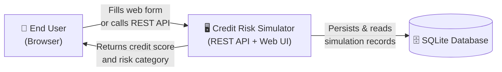
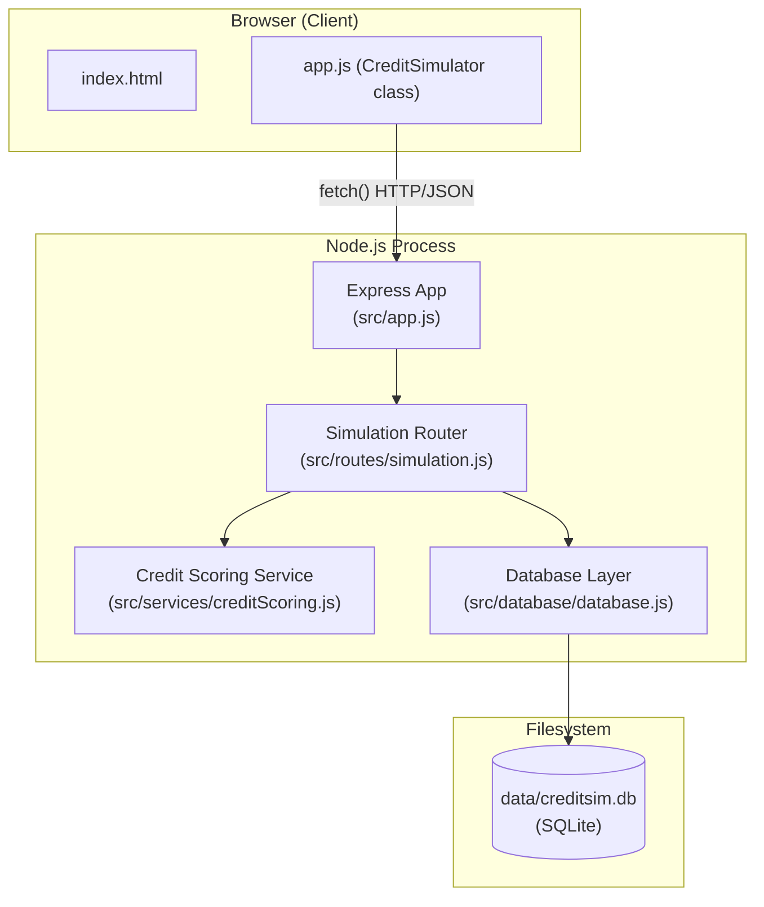
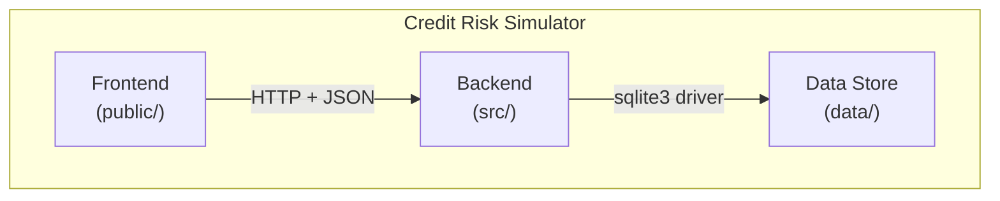
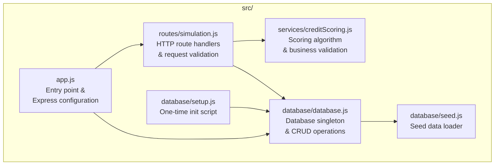
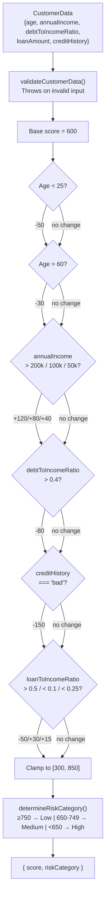
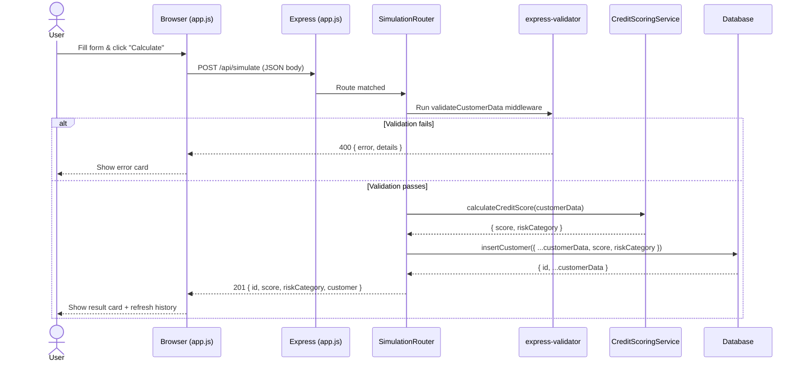
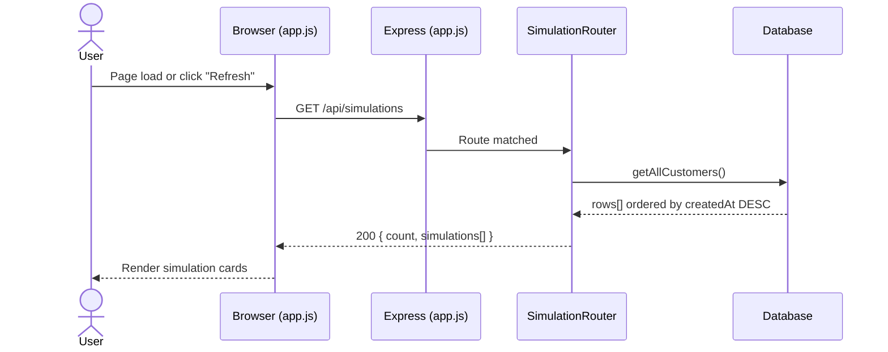
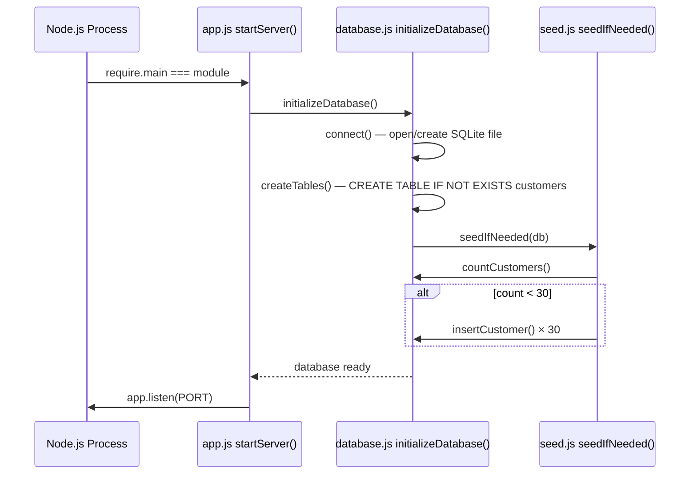
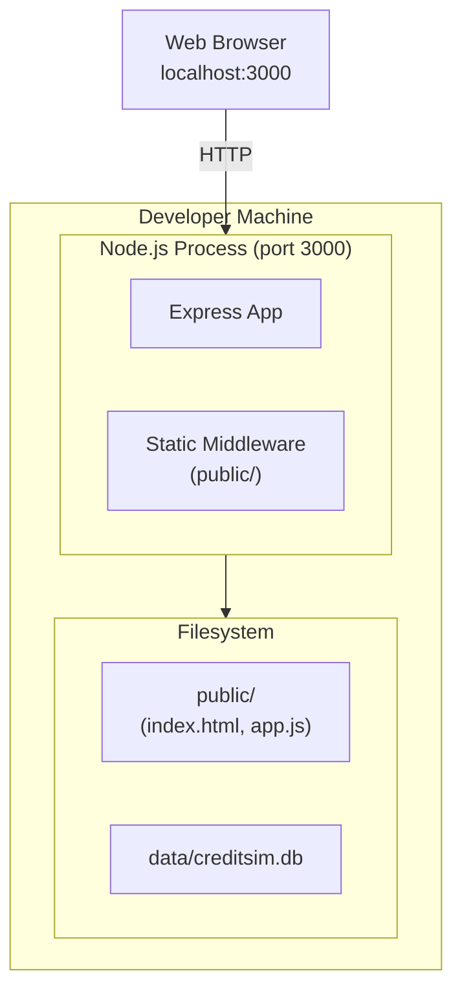

# Credit Risk Simulator — arc42 Architecture Documentation

> ⚠️ **Disclaimer**: This is a demonstration application only. It must not be used for actual credit decisions or in production environments.

---

## Table of Contents

1. [Introduction and Goals](#1-introduction-and-goals)
2. [Constraints](#2-constraints)
3. [Context and Scope](#3-context-and-scope)
4. [Solution Strategy](#4-solution-strategy)
5. [Building Block View](#5-building-block-view)
6. [Runtime View](#6-runtime-view)
7. [Deployment View](#7-deployment-view)
8. [Crosscutting Concepts](#8-crosscutting-concepts)
9. [Architecture Decisions](#9-architecture-decisions)
10. [Quality](#10-quality)
11. [Risks and Technical Debt](#11-risks-and-technical-debt)
12. [Glossary](#12-glossary)

---

## 1. Introduction and Goals

### 1.1 System Purpose

**Credit Risk Simulator** is a lightweight, educational web application that calculates simulated credit risk scores from a set of customer demographic and financial inputs. It is designed to demonstrate a full-stack Node.js architecture — from browser form submission through REST API to persistent storage — while showcasing a transparent, rule-based scoring model.

### 1.2 Goals

| Priority | Goal |
|----------|------|
| 1 | Provide an interactive UI that lets users enter customer data and immediately see a computed credit score |
| 2 | Expose a clean REST API that can be consumed by external clients |
| 3 | Persist every simulation so users can review historical results |
| 4 | Demonstrate secure input handling (validation, SQL-injection prevention, XSS headers) |
| 5 | Achieve high automated test coverage of both the scoring logic and HTTP endpoints |

### 1.3 Stakeholders

| Stakeholder | Expectation |
|-------------|-------------|
| Developer / learner | Understand a complete Node.js/Express web-app architecture |
| Demonstrator | Quickly run a live demo of credit scoring in a browser |
| QA Engineer | Validate correctness via automated unit and integration tests |

---

## 2. Constraints

### 2.1 Technical Constraints

| Constraint | Rationale |
|------------|-----------|
| Node.js ≥ 14 runtime | Async/await support; broad platform availability |
| SQLite for persistence | Zero-config embedded database, suitable for demos |
| No external credit bureau APIs | Educational/demo scope only; no real data access |
| No authentication / sessions | Out-of-scope for a demo; deliberately omitted |
| No rate limiting | Simplicity; noted as a known limitation |

### 2.2 Organisational Constraints

| Constraint | Rationale |
|------------|-----------|
| MIT licence | Open for learning and extension |
| Single-developer project | No CI/CD pipeline or branching strategy enforced |
| Not for production | All disclaimers throughout UI, API, and docs |

---

## 3. Context and Scope

### 3.1 Business Context

The system has **one external actor**: the human user, who interacts either through the web browser UI or directly with the REST API (e.g., from Postman or a script). There are no integrations with external credit bureaus, identity providers, or message queues.

### 3.2 Technical Context

| Interface | Protocol | Format |
|-----------|----------|--------|
| Browser → Server | HTTP 1.1 | JSON (API) / HTML (static files) |
| Server → SQLite | Local file I/O (sqlite3 driver) | SQL |
| CDN assets | HTTPS | CSS/JS (Bootstrap 5, Bootstrap Icons) |

---

## 4. Solution Strategy

| Decision | Choice | Rationale |
|----------|--------|-----------|
| Runtime | Node.js + Express.js | Lightweight, well-known, low-ceremony REST framework |
| Database | SQLite (via `sqlite3` npm package) | Zero infrastructure; single file; sufficient for demo scale |
| Frontend | Vanilla HTML/CSS + Bootstrap 5 + Fetch API | No build toolchain; easy to understand; responsive out of the box |
| Scoring | Rule-based scoring function | Deterministic, transparent, fully testable without ML dependency |
| Validation | `express-validator` (HTTP layer) + `validateCustomerData` (service layer) | Defence-in-depth: invalid data rejected at both layers |
| Security headers | `helmet` | Minimal config to add CSP, XSS protection, etc. |
| Testing | Jest + Supertest | Covers both pure-function unit tests and HTTP integration tests |

The architecture follows a classic **three-layer** pattern:

1. **Presentation layer** — `public/` static files served by Express
2. **Application / API layer** — Express routes + business-logic service
3. **Data layer** — SQLite database accessed through a singleton `Database` class

---

## 5. Building Block View

### 5.1 Level 1 — System Overview

### 5.2 Level 2 — Backend Decomposition

#### Component Responsibilities

| Component | File | Responsibility |
|-----------|------|----------------|
| **Express App** | `src/app.js` | Middleware wiring (helmet, cors, body-parser, static), route mounting, error handlers, graceful shutdown |
| **Simulation Router** | `src/routes/simulation.js` | Validates HTTP requests via `express-validator`, calls service and database, returns JSON responses |
| **Credit Scoring Service** | `src/services/creditScoring.js` | Pure scoring function (`calculateCreditScore`), risk categorisation, service-layer validation |
| **Database Class** | `src/database/database.js` | Singleton SQLite connection; `connect`, `createTables`, `insertCustomer`, `getAllCustomers`, `getCustomerById`, `countCustomers`, `close` |
| **Seed Module** | `src/database/seed.js` | Idempotent seeding of 30 sample simulations on first run |
| **Setup Script** | `src/database/setup.js` | CLI script that creates the `data/` directory and initialises the database |
| **Frontend HTML** | `public/index.html` | Bootstrap 5 UI: form, result card, simulation history list |
| **Frontend JS** | `public/app.js` | `CreditSimulator` class: event wiring, `fetch()` calls, DOM updates, HTML escaping |

### 5.3 Level 3 — Credit Scoring Service

---

## 6. Runtime View

### 6.1 Scenario: Submit a New Simulation

### 6.2 Scenario: Load Simulation History

### 6.3 Scenario: Application Startup

---

## 7. Deployment View

### 7.1 Local Development (Default)

| Resource | Value |
|----------|-------|
| Default port | `3000` (override via `PORT` env var) |
| Database path | `data/creditsim.db` (relative to project root) |
| Node.js version | ≥ 14 |
| Start command | `npm start` (`node src/app.js`) |
| Dev hot-reload | `npm run dev` (nodemon) |

### 7.2 Environment Variables

| Variable | Default | Description |
|----------|---------|-------------|
| `PORT` | `3000` | TCP port the Express server listens on |
| `NODE_ENV` | `development` | Controls verbosity of error messages in responses |

---

## 8. Crosscutting Concepts

### 8.1 Input Validation (Defence-in-Depth)

Validation is applied at **two independent layers**:

1. **HTTP layer** (`src/routes/simulation.js`) — `express-validator` decorators on each route; returns structured `400` responses with per-field error details.
2. **Service layer** (`src/services/creditScoring.js`) — `validateCustomerData()` throws `Error` with combined message; protects the scoring function regardless of how it is called.

### 8.2 Security

| Concern | Mitigation |
|---------|------------|
| XSS in HTTP responses | `helmet` sets `Content-Security-Policy`, `X-XSS-Protection`, etc. |
| XSS in frontend rendering | `escapeHtml()` in `public/app.js` sanitises all user-supplied values before `innerHTML` insertion |
| SQL injection | All DB queries use parameterised statements (`?` placeholders) |
| Sensitive error leakage | Stack traces only returned when `NODE_ENV === 'development'` |
| CORS | `cors()` middleware; default configuration (open) — suitable for demo |

### 8.3 Error Handling

A global error-handler middleware (`app.use((err, req, res, next) => …)`) in `src/app.js` catches any unhandled exceptions in route handlers and returns a consistent `500` JSON body. A dedicated `404` fallback follows the global handler.

### 8.4 Graceful Shutdown

`SIGINT` and `SIGTERM` signals are intercepted in `src/app.js` to allow clean process exit. The `database.close()` method ensures the SQLite write-ahead log is flushed.

### 8.5 Database Singleton Pattern

`src/database/database.js` exports a module-level `const database = new Database()` instance. All route handlers share this single connection, preventing multiple concurrent opens of the same SQLite file.

### 8.6 Idempotent Seeding

`seedIfNeeded()` checks `countCustomers()` before inserting. If the table already has ≥ 30 rows the seed is skipped, making restarts safe.

### 8.7 Testing Strategy

| Layer | Framework | Files |
|-------|-----------|-------|
| Unit (scoring logic) | Jest | `tests/creditScoring.test.js` |
| Integration (HTTP endpoints) | Jest + Supertest | `tests/api.test.js` |

The test suite spins up the real Express app against an in-process SQLite database, so it covers the full stack from HTTP request to database write and read.

---

## 9. Architecture Decisions

### ADR-001: SQLite as the Only Data Store

**Context**: The application needs to persist simulation records without imposing infrastructure dependencies on the operator.

**Decision**: Use SQLite via the `sqlite3` npm package. The database file is stored at `data/creditsim.db`.

**Consequences (+/-)**: (+) Zero-config; no separate server process; single-file backup. (−) Not suitable for concurrent writes or multi-process deployment.

---

### ADR-002: Rule-Based Scoring Algorithm (No ML)

**Context**: The system must calculate a credit score from five input features.

**Decision**: Implement a deterministic, rule-based function with a base score of 600 and fixed additive/subtractive adjustments per feature band.

**Consequences (+/-)**: (+) Fully transparent; 100% testable with expected values; no model training/versioning. (−) Does not capture complex feature interactions; not reflective of real-world models.

---

### ADR-003: No Build Step for the Frontend

**Context**: The UI needs to be simple and immediately runnable.

**Decision**: Use plain HTML + Bootstrap 5 (CDN) + vanilla JavaScript served directly as static files by Express. No webpack, Vite, or TypeScript compilation.

**Consequences (+/-)**: (+) Zero build toolchain; easy to read and modify. (−) No tree-shaking, module bundling, or type safety.

---

### ADR-004: Defence-in-Depth Validation

**Context**: Input data must be validated before scoring and persistence.

**Decision**: Apply `express-validator` at the HTTP layer and a separate `validateCustomerData()` function inside the service. Both layers must independently reject invalid input.

**Consequences (+/-)**: (+) The service is safe to call from non-HTTP contexts (tests, scripts). (+) Provides structured error detail in HTTP responses. (−) Slight code duplication of constraint definitions.

---

### ADR-005: Helmet for Security Headers

**Context**: A browser-facing application must mitigate common web vulnerabilities.

**Decision**: Use `helmet` with a custom `contentSecurityPolicy` that whitelists only the Bootstrap CDN and self-hosted scripts/styles.

**Consequences (+/-)**: (+) Reduces XSS and clickjacking attack surface with minimal code. (−) CSP requires updating when new CDN domains are added.

---

## 10. Quality

### 10.1 Quality Goals

| Quality Attribute | Scenario | Measure |
|-------------------|----------|---------|
| **Correctness** | Given a known set of inputs, the score must equal the deterministic formula result | All unit tests in `creditScoring.test.js` pass (expected values hard-coded) |
| **Reliability** | The API must return consistent HTTP status codes for valid/invalid inputs | Integration tests in `api.test.js` cover all happy-path and error-path HTTP responses |
| **Security** | User-supplied strings must not be rendered as raw HTML | `escapeHtml()` used in all `innerHTML` assignments; Helmet CSP enforced |
| **Usability** | A user should be able to calculate a score without reading documentation | Single-page form with inline validation feedback; result displayed inline |
| **Maintainability** | The scoring model adjustments must be readable and independently testable | `calculateCreditScore` is a pure function; each rule branch has a dedicated test |

### 10.2 Test Coverage Summary

| Test file | Covers |
|-----------|--------|
| `tests/creditScoring.test.js` | `calculateCreditScore` (8 cases), `determineRiskCategory` (3 cases), `validateCustomerData` (7 cases), `getScoringCriteria` (1 case) |
| `tests/api.test.js` | POST `/api/simulate` (5 cases), GET `/api/simulations` (2), GET `/api/simulation/:id` (3), GET `/api/scoring-criteria` (1), GET `/api/health` (1), GET `/` (1), 404 (1) |

Run with: `npm test`

---

## 11. Risks and Technical Debt

| ID | Risk / Debt | Severity | Mitigation / Recommendation |
|----|-------------|----------|-----------------------------|
| R-01 | **No authentication** — any user can read all simulations | High | Add JWT or session-based auth before any real deployment |
| R-02 | **No rate limiting** — API is susceptible to abuse / DoS | High | Add `express-rate-limit` middleware |
| R-03 | **SQLite concurrency** — write operations serialise under high load | Medium | Migrate to PostgreSQL or MySQL for multi-user production use |
| R-04 | **Simplified scoring model** — does not reflect real credit bureau logic | Medium | Document clearly; never use for actual credit decisions |
| R-05 | **No HTTPS enforcement** — traffic is unencrypted in local setup | Medium | Terminate TLS at a reverse proxy (nginx/Caddy) in any public deployment |
| R-06 | **CSP `unsafe-inline` for styles** — weaker XSS protection | Low | Extract inline styles to a stylesheet or use a nonce |
| R-07 | **No pagination on `/api/simulations`** — unbounded result set | Low | Add `limit`/`offset` query parameters |
| R-08 | **No data retention policy** — database grows indefinitely | Low | Add a cleanup/archival strategy |

---

## 12. Glossary

| Term | Definition |
|------|------------|
| **Credit Score** | A numeric value (300–850 in this system) representing an individual's estimated creditworthiness; higher is better |
| **Risk Category** | A label derived from the credit score: *Low risk* (≥ 750), *Medium risk* (650–749), *High risk* (< 650) |
| **Debt-to-Income Ratio (DTI)** | Total monthly debt payments divided by gross monthly income, expressed as a decimal (0–1) |
| **Loan-to-Income Ratio (LTI)** | Requested loan amount divided by annual income, expressed as a decimal |
| **Base Score** | The starting value (600) before any adjustments are applied |
| **Simulation** | One execution of the scoring algorithm for a given set of customer inputs, persisted as a row in the `customers` table |
| **Seed Data** | 30 pre-defined customer records inserted on first startup to populate the simulation history |
| **Singleton** | A design pattern that restricts instantiation of a class to a single object; used for the `Database` connection |
| **FICO Range** | The standard 300–850 credit score range used by the US Fair Isaac Corporation; this system mimics that range |
| **CSP** | Content Security Policy — an HTTP response header that restricts which scripts and styles the browser may load |
| **DTI penalty** | A score deduction of −80 applied when `debtToIncomeRatio > 0.4` |
| **express-validator** | An npm library providing chainable validation/sanitisation middleware for Express.js |
| **Supertest** | An npm library for testing HTTP servers by making real requests against an in-process Express app |
